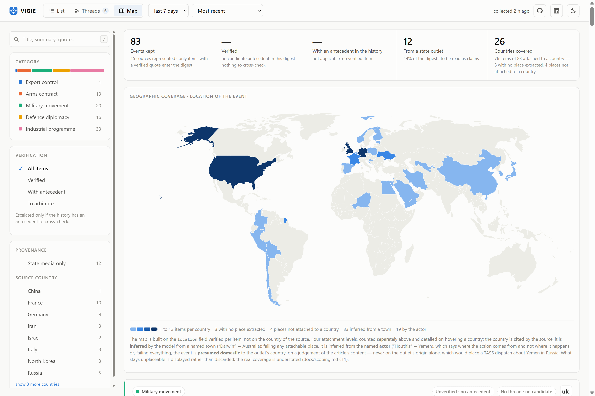
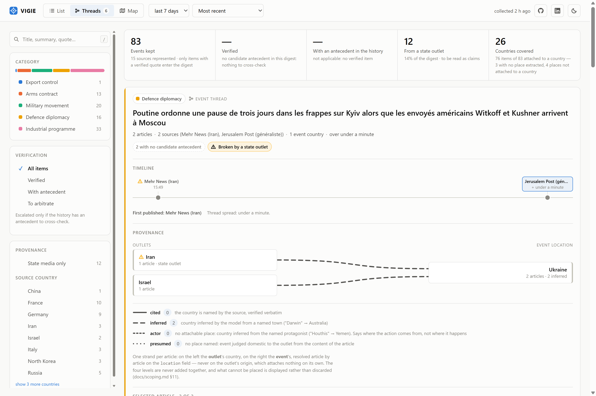

# VIGIE — Agent de veille export & risque défense/géopolitique

[](https://github.com/Adrien-1997/vigie-01/actions/workflows/ci.yml)
[](LICENSE)

Agent IA autonome qui collecte, classe et synthétise quotidiennement des sources ouvertes sur un périmètre défense/géopolitique restreint, avec traçabilité systématique de chaque affirmation vers sa source.

**Statut** : pipeline V1 fonctionnel de bout en bout (collecte → dédoublonnage → classification → vérification → regroupement en threads → API → frontend), première tranche du vérificateur V2 et première tranche du raisonnement longitudinal V3 livrées. Le déploiement est **écrit et validé en local** — image conteneur, Job d'exécution, journalisation structurée, endpoint de run fermé — mais **aucune ressource cloud n'a été provisionnée** : Firestore n'a toujours jamais tourné. Détail dans [Roadmap](#roadmap).

Le raisonnement derrière les décisions techniques — garde-fous, invariants de durabilité, règles de
restitution, conduite de la campagne — est dans [`docs/decisions.md`](docs/decisions.md). Le cadrage
produit est dans [`docs/cadrage.md`](docs/cadrage.md).


Chaque fiche porte les signaux qui engagent la confiance — citation vérifiée verbatim, antécédent
trouvé ou non dans l'historique, provenance « média d'État », score du vérificateur — et un item
que le vérificateur n'a pas escaladé sort **sans** score plutôt qu'avec un zéro trompeur, en
disant laquelle des raisons s'applique. Ces mentions sont alignées d'une fiche à l'autre : sur un
digest de deux cents items, elles se balaient en une passe au lieu de se relire fiche par fiche.



La carte est construite sur le lieu vérifié de chaque événement, jamais sur le pays de la source,
et affiche ce qu'elle ne peut pas placer plutôt que de surestimer sa couverture. Quatre niveaux de
rattachement — cité, déduit, acteur, présumé domestique — restent comptés séparément.



Un **thread** rassemble les articles qui couvrent le même dossier — mêmes parties, même opération —
et non le même thème. Sa chronologie est à l'échelle réelle du temps : l'écart entre les parutions
est le signal. Aucun indice de fiabilité n'est agrégé au niveau du thread.

## Cadrage

Cadrage complet — problématique, périmètre MECE, alternatives évaluées, KPIs, matrice de risques, gouvernance, plan de livraison — dans [`docs/cadrage.md`](docs/cadrage.md). Synthèse visuelle : [support de présentation navigable](https://adrien-1997.github.io/vigie-01/slides.html) (source : [`docs/slides.html`](docs/slides.html)).

**Valeur** : diviser le temps de synthèse quotidienne, standardiser la lecture des signaux faibles, tracer la fiabilité de chaque information remontée.

**Périmètre V1** : export control, contrats d'armement, mouvements militaires, diplomatie défense, programmes industriels — filtrage thématique (le lieu est extrait comme métadonnée, sans restreindre la collecte, cf. cadrage §4).

**Sources** : 18 flux RSS gratuits, organisés par pays plutôt que par thème — les 10 premiers exportateurs mondiaux d'armement (classement SIPRI *Trends in International Arms Transfers*, données 2020-24) plus l'Iran et la Corée du Nord pour la couverture export-contrôle. Chaque flux est validé en direct avant intégration ; les sources d'État (seule option gratuite disponible pour plusieurs de ces pays) sont marquées `state_affiliated` et restent visibles comme telles en aval, plutôt que d'être exclues ou mélangées silencieusement au reste. Le volume est plafonné par flux (`MAX_ITEMS_PER_SOURCE_PER_RUN`, cf. Garde-fous ci-dessous) plutôt que par flux à égalité de traitement : sans ce plafond, une agence de presse à cadence élevée épuisait le budget quotidien au détriment des sources spécialisées à plus faible volume mais plus fort signal.

## Architecture

```
Sources (RSS par pays, presse spécialisée, communiqués)
        │
        ▼
  Agent collecteur ──► Mémoire courte ──► Agent analyste
   (backend/agents/     (dédoublonnage,     (classification, résumé,
    collector.py)        avant l'appel LLM)  citation vérifiée)
                          backend/memory/     backend/agents/analyst.py
                          store.py                    │
                                                      ▼
                                            Agent vérificateur
                                            (backend/agents/verifier.py)
                                            recoupement sur l'historique,
                                            score de confiance
                                                      │
                                                      ▼
                                            Agent de regroupement
                                            (backend/agents/threader.py)
                                            threads d'événements sur
                                            l'historique
                                                      │
                                                      ▼
                                     API (FastAPI) ──► Front (digest filtrable,
                                     backend/api/       threads, carte de couverture)
                                     main.py             frontend/ (React + Vite)
```

Implémenté comme un `StateGraph` LangGraph (`backend/graph.py`) : chaque étape est un nœud, l'état partagé (`VigieState`, `backend/state.py`) transporte les items d'un nœud à l'autre. Le dédoublonnage est placé *avant* l'appel LLM, pas après, pour ne pas consommer de budget sur des items déjà vus. LangSmith trace chaque nœud sans instrumentation manuelle.

Quatre décisions structurent ce pipeline — le digest comme fenêtre glissante et non comme
photographie d'un run, la persistance derrière une interface unique, la séparation volontaire
entre workflow déterministe et boucle agentique, et les divergences assumées du regroupement en
threads. Elles sont documentées dans [`docs/decisions.md`](docs/decisions.md).

## Résultats mesurés

Chiffres datés, et non des cibles. Définitions et réserves méthodologiques en
[`docs/cadrage.md` §7](docs/cadrage.md) ; outillage dans `backend/eval/`.

| Mesure | Résultat | Cible |
|---|---|---|
| Précision de classification (2026-08-22, n=48, annotation en aveugle) | 38/48 = **79 %**, IC95 [66 % ; 88 %] | ≥ 85 % |
| → décision de périmètre seule (dans / hors) | 42/48 = 87,5 % — précision 89 %, rappel 89 % (F1 0,89) | — |
| → catégorie la plus faible | `programme_industriel` — F1 0,67, 7 des 10 désaccords | — |
| Couverture des sources (2026-08-30, fenêtre 96 h) | 17/18 flux actifs | — |
| Items écartés par le plafond par source (même fenêtre) | 234 sur 7 flux | — |
| Historique accumulé (2026-08-30) | 45 items sur un jour — les 295 items accumulés jusqu'au 2026-08-22 sont sortis de la fenêtre glissante de 7 jours pendant un trou de 8 jours sans lancement, et ont été purgés au run suivant | — |
| Coût d'un run complet (2026-08-22) | 195 appels LLM sur un plafond de 200 — analyse 72, vérification 50, regroupement 73 | — |
| Dépense d'analyse écartée (2026-08-30, premier lot complet ventilé) | 99 des 144 appels d'analyse (**69 %**) sur des items non retenus — hors périmètre 72, citation non vérifiable 26 | — |
| Retest de la frontière `contrat_armement`/`programme_industriel` (2026-08-23, n=17, 2 bras) | cible atteinte : 2 cas gagnés, 0 régression introduite — mais 2 régressions **antérieures** trouvées et attribuées au changement de la veille | — |

Ce chiffre de précision **a vieilli** : le prompt de classification a changé deux fois depuis qu'il
a été mesuré (le 2026-08-22 et le 2026-08-23), et le remesurer coûte un budget quotidien entier. Il
reste la dernière mesure en aveugle disponible, pas une description du code courant.

À cette taille d'échantillon, **la cible de 85 % est à l'intérieur de l'intervalle de confiance** :
la mesure ne conclut donc ni que le produit l'atteint, ni qu'il est en dessous. La mesure précédente
(75 %, n=68) l'excluait, mais les deux ne sont pas comparables — celle-ci est la première annotée en
aveugle, la composition des sources a changé, et le prompt a reçu les précisions de frontière §4.

La décomposition reste le résultat utile : le filtrage du bruit atteint la cible, la qualification
fine ne la tient pas, et une seule frontière porte l'essentiel de l'écart — celle entre
`contrat_armement` et `programme_industriel`, avec un motif constant sur deux mesures : le modèle
classe d'après l'acteur visible (une marine cliente) plutôt que d'après l'objet de l'article (un
jalon de construction ou de livraison). L'analyse a corrigé son propre diagnostic en chemin : le
cadrage n'énonçait rien sur cette frontière, mais le prompt de classification portait une règle non
documentée depuis cinq jours — sur le cas le plus net, le modèle appliquait donc fidèlement une
règle écrite que l'annotation contredit. Désaccord de spécification, pas lacune de spécification :
la règle a été **changée** et reportée dans le cadrage, une livraison relevant désormais du
programme et `contrat_armement` se resserrant sur l'acte commercial. Sondée le jour même sur les
deux appels restants, elle n'est **efficace qu'à moitié** : le cas de la livraison bascule comme
voulu, celui du financement ne bouge pas alors que la règle le nomme mot pour mot. Une règle peut
être écrite, juste, et rester sans effet — un retest complet avec contrôles de non-régression est
dû avant de la considérer acquise. Le précédent qui rend l'opération prévisible : la frontière
`diplomatie_defense` / `mouvement_militaire`, spécifiée après une mesure antérieure où elle
dominait, est aujourd'hui la mieux tenue de l'échantillon.

Deux mesures antérieures (n=30 puis n=88) et les correctifs de définition qu'elles ont déclenchés
sont détaillés en [§7](docs/cadrage.md). Ce qui n'est **pas** mesuré est dit comme tel : le
vérificateur, dont l'extension aux cinq catégories a tourné en réel pour la première fois le
2026-08-21, a produit 15 scores sur 36 items ce jour-là (5 avec antécédent), contre 20 scores
sur 261 items — 2 avec antécédent — sous l'ancienne règle par catégorie. Le regroupement compte
11 threads. Le critère d'acceptation des threads est **atteint** : sur l'échantillon de
65 paires gelé et annoté le 2026-08-20, les 13 paires intra-thread sont toutes jugées même dossier
(précision 100 %) — une précision, pas un rappel, un dossier que le modèle n'a pas su rapprocher ne
produisant aucune paire à annoter.

## Stack

| Composant       | Choix                                    | Statut                |
|-----------------|-------------------------------------------|------------------------|
| Orchestration   | LangGraph / LangChain                    | construit (V1)          |
| LLM             | Claude Haiku via `langchain-anthropic`   | construit (V1)          |
| Backend         | Python 3.13, FastAPI                     | construit (V1)          |
| Observabilité   | LangSmith (tracing natif par nœud)       | construit (V1)          |
| Frontend        | React + TypeScript + Vite                | construit (V1)          |
| Vérificateur (recoupement, score de confiance) | LangGraph + tool-calling borné | 1ʳᵉ tranche construite ; périmètre étendu aux 5 catégories, escalade conditionnée à un antécédent |
| Carte de couverture interactive | d3-geo + Natural Earth, sur le champ `location` | construite (V2, 1ʳᵉ tranche) |
| Threads d'événements (regroupement longitudinal) | LangGraph + tool-calling borné, chronologie et provenance côté front | 1ʳᵉ tranche construite (V3) |
| Déploiement     | Cloud Run **Job** (run quotidien) + service (digest) + Cloud Scheduler ; front sur Firebase Hosting | image et runbook écrits, conteneur validé en local ; **rien de provisionné en cloud** |
| Journalisation  | JSON structuré sur stdout, lu par Cloud Logging | construit et validé en conteneur |
| Stockage        | Fichiers JSON locaux (dev) / Firestore (production), derrière une interface unique | construit en local ; backend Firestore écrit mais **non validé contre une base réelle** |


## Structure du repo

```
vigie/
├── backend/
│   ├── agents/
│   │   ├── collector.py       # collecte RSS par pays, sources validées en direct
│   │   ├── analyst.py         # classification MECE, résumé FR, citation + lieu vérifiés
│   │   ├── verifier.py        # recoupement + score de confiance (boucle tool-calling bornée)
│   │   └── threader.py        # regroupement en threads d'événements (même patron borné)
│   ├── api/
│   │   └── main.py            # FastAPI : /health, /run, /events
│   ├── eval/
│   │   ├── build_sample.py    # échantillon stratifié pour mesurer la précision
│   │   ├── annotate.py        # annotation manuelle interactive
│   │   ├── score.py           # précision mesurée vs cible (cadrage §7)
│   │   ├── candidates.py      # densité de candidats de recoupement, sans appel LLM
│   │   ├── build_pairs.py     # gèle un échantillon de paires (threads + bandes de score)
│   │   ├── annotate_pairs.py  # annotation manuelle « même dossier ? »
│   │   └── score_pairs.py     # précision du threading + effet d'un seuil
│   ├── memory/
│   │   ├── store.py           # dédoublonnage + historique analysé (recoupement et digest)
│   │   └── persistence.py     # fichiers JSON locaux (dev) ou Firestore (prod), même interface
│   ├── config.py               # sources RSS par pays, garde-fous obligatoires, exposition de l'API
│   ├── guardrails.py           # plafond d'appels LLM quotidien
│   ├── graph.py                 # assemblage StateGraph LangGraph
│   ├── job.py                   # point d'entrée du Job quotidien (déploiement)
│   ├── logging_setup.py         # journal JSON structuré, exploitable par Cloud Logging
│   ├── state.py                 # schéma d'état partagé (VigieState)
│   ├── requirements.txt
│   └── requirements-gcp.txt     # dépendance Firestore, déploiement uniquement
├── frontend/                    # React + TypeScript + Vite, appelle l'API réelle
│   ├── src/
│   │   ├── assets/logos/        # marques des médias, collectées hors ligne (cf. scripts/)
│   │   ├── components/          # digest filtrable, threads (chronologie + provenance),
│   │   │                        #   carte de couverture
│   │   └── lib/                 # taxonomie, filtres/tri, résolution des lieux, modèle de thread
│   └── firebase.json            # hébergement du front (Firebase Hosting)
├── scripts/
│   ├── daily_run.py             # lancement quotidien + journal de campagne (hors service)
│   └── fetch_logos.py           # collecte unique des logos des médias (hors service)
├── tests/                       # pytest — LLM et flux RSS mockés
├── infra/
│   └── README.md                # runbook de mise en production, commande par commande
├── docs/
│   ├── cadrage.md               # cadrage produit (problématique, MECE, risques, KPIs)
│   ├── decisions.md             # choix d'ingénierie : garde-fous, invariants, campagne
│   ├── index.html               # racine GitHub Pages (redirige vers les slides)
│   ├── slides.html              # support de présentation navigable
│   └── screenshot*.png          # captures régénérées contre l'application réelle
├── Dockerfile                   # une image, deux usages : le service et le Job
├── .dockerignore
├── .env.example
├── LICENSE
└── README.md
```

## Démarrage rapide

```bash
git clone https://github.com/Adrien-1997/vigie-01.git
cd vigie-01

python -m venv .venv
source .venv/bin/activate        # .venv\Scripts\activate sous Windows

pip install -r backend/requirements.txt

cp .env.example .env             # renseigner ANTHROPIC_API_KEY, LANGCHAIN_API_KEY (LangSmith),
                                  # MAX_STEPS_PER_RUN, MAX_LLM_CALLS_PER_DAY (garde-fous obligatoires),
                                  # et RUN_TOKEN pour pouvoir appeler POST /run

uvicorn backend.api.main:app --reload --port 8080
```

Dans un second terminal, pour le frontend :

```bash
cd frontend
npm install
npm run dev
```

Les marques des médias affichées sur les fiches sont versionnées avec le front ; elles ne sont
recollectées que si `backend/config.py` gagne une source (`python -m scripts.fetch_logos`, sans
appel LLM). Une source sans logo s'affiche en monogramme.

Ouvrir `http://localhost:5173`. Le front lit le digest, il ne le déclenche pas : la collecte se lance côté serveur, par `python -m scripts.daily_run` ou `POST /run` (pipeline complet, ~10 min, consomme du budget LLM réel). Cet endpoint est fermé par un jeton partagé — il répond 503 tant que `RUN_TOKEN` n'est pas défini, puis exige l'en-tête `X-Run-Token` — parce qu'il déclenche à lui seul la dépense de la journée. L'URL de l'API est `http://localhost:8080` par défaut, surchargeable via `VITE_API_BASE` ; les origines autorisées à l'appeler depuis un navigateur sont listées dans `ALLOWED_ORIGINS`.

## Accumulation d'historique

Le déclenchement automatique (Cloud Scheduler) n'étant pas déployé, le pipeline est lancé à la main.
Le script journalise **chaque** lancement, y compris ceux qui ne produisent rien ou qui échouent :
un jour sans nouveauté et un jour non lancé laissent la même trace dans l'historique, alors que le
premier est une mesure et le second un trou.

```bash
python -m scripts.daily_run              # le lancement quotidien
python -m scripts.daily_run --dry-run    # état de la campagne, sans consommer de budget
```

**Campagne close le 2026-08-20** (5 lancements, 7 jours continus, 261 items). Elle visait quinze
jours d'historique avant de rejouer la mesure d'appariement ; la rétention ayant été ramenée le même
jour de 30 à 7 jours pour le coût de stockage, cette assiette est devenue inatteignable par
construction — le jour le plus ancien est purgé à chaque run. La mesure a donc été prise sur sept
jours, et à cette taille elle discrimine (cf. [§10](docs/cadrage.md)).

Conséquence de méthode qui vaut pour la suite : **un corpus se gèle hors du stock au moment où il
est mesuré**. Une mesure qui relit l'historique à la demande n'est pas rejouable — recalculée une
semaine plus tard, elle ne retrouve plus aucun des items d'origine, et une annotation manuelle
serait perdue avec eux.

Raison d'être de la campagne, fenêtre de rattrapage et KPI de couverture : [`docs/decisions.md`](docs/decisions.md).

## Roadmap

- [x] V1 — collecte + dédoublonnage + classification + résumé tracé + API + frontend
- [x] V1 — sources organisées par pays (top 10 exportateurs SIPRI + Iran/Corée du Nord), validées en direct
- [~] V1 — déploiement Cloud Run : **la moitié dépôt est faite et validée en local** (2026-08-23) — journal JSON structuré sur les cinq nœuds, `POST /run` fermé par jeton, CORS restreint, dépendances épinglées, image Python 3.13, Job d'exécution quotidien, runbook complet dans [`infra/`](infra/README.md). Le Job a tourné de bout en bout en conteneur contre des flux RSS réels, plafond d'appels forcé à zéro pour exercer la troncature sans dépenser. **La moitié cloud reste entière** : aucun projet GCP provisionné, Firestore jamais exécuté
- [~] V2 — agent vérificateur : recoupement et score de confiance livrés ; périmètre étendu aux cinq catégories le 2026-08-20, l'escalade étant conditionnée à un antécédent candidat mesuré plutôt qu'à la catégorie, et exécuté en réel le 2026-08-21 (15 escalades sur 36 items, 5 avec antécédent) — `fetch_full_article` à venir
- [~] V2 — carte de couverture interactive livrée (filtrage par pays depuis le champ `location`) ; sectorisation par thème à venir
- [~] V3 — raisonnement longitudinal sur l'historique : le pipeline traitait chaque item isolément, alors qu'une part du signal se situe entre les items (un dossier qui évolue, la fréquence d'un pays qui monte). Cinq tranches séquencées, cadrées en [§10](docs/cadrage.md) :
  - [x] threads d'événements — regrouper les items d'un même dossier, restitués en chronologie à l'échelle réelle du temps avec le croisement média/lieu de l'événement. Critère d'acceptation **atteint** (2026-08-20) : précision 100 % sur les 13 paires intra-thread annotées
  - [ ] brief hebdomadaire — tendances de volume par catégorie/pays vs semaine précédente, chiffres issus d'une agrégation et non du modèle
  - [ ] détection de signal faible — concentration inhabituelle d'items corroborés sur un couple pays/catégorie
  - [ ] restitution temporelle — axe de temps des séries de volume, distinct du thread par dossier
  - [ ] mémoire interrogeable (requêtes en langage naturel)

## Garde-fous

Plafond d'appels LLM par jour, plafond de steps par run, double plafond sur chaque boucle
agentique, fenêtre de fraîcheur et plafond par source à la collecte, rejet automatique d'un résumé
sans citation vérifiable. Tous vérifiés en code, pas seulement déclarés en configuration — et un
plafond atteint **tronque** le run au lieu de l'annuler, pour qu'un garde-fou de coût ne détruise
pas le travail qu'il vient de faire payer. Détail de chacun, et ce que chacun a coûté : [`docs/decisions.md`](docs/decisions.md).

## Qualité & CI

- Lint et format : `ruff` (config dans `pyproject.toml`)
- Tests : `pytest` (`tests/`, LLM et flux RSS mockés — rapides, déterministes, sans coût)
- CI : `.github/workflows/ci.yml`, lance lint + format + tests sur chaque push/PR

## Note

Projet de démonstration à vocation portfolio. Le pipeline et l'API sont réels et fonctionnels (sources RSS live, appels LLM réels, mesures réelles). Le déploiement est écrit, conteneurisé et validé en local, mais rien n'a encore été provisionné en cloud — et la persistance de production, Firestore, reste le seul composant du système qui n'a jamais tourné contre du réel. Le vérificateur, lui, ne score que les items dont l'historique porte un antécédent à recouper : les autres sortent sans score de confiance plutôt qu'avec un score fabriqué par défaut.

## Licence

[MIT](LICENSE) — code réutilisable librement, y compris commercialement, sous réserve de conserver
la mention de copyright. Les captures d'écran reproduisent des titres de presse dont les droits
restent à leurs éditeurs respectifs.
